# SPORT CONNECT - Documentation UML Complète
## Écosystème Numérique du Sport Malgache
### Version 1.0 - Numérique de Madagascar 2035

---

## Table des Matières

1. [Diagrammes de Cas d'Utilisation (Use Case)](#1-diagrammes-de-cas-dutilisation)
2. [Diagrammes de Classes](#2-diagrammes-de-classes)
3. [Diagrammes de Séquence](#3-diagrammes-de-séquence)
4. [Diagrammes d'Activité](#4-diagrammes-dactivité)
5. [Diagrammes d'État](#5-diagrammes-détat)
6. [Diagrammes de Composants](#6-diagrammes-de-composants)
7. [Diagrammes de Déploiement](#7-diagrammes-de-déploiement)
8. [Diagrammes de Packages](#8-diagrammes-de-packages)

---

## 1. Diagrammes de Cas d'Utilisation

### 1.1 Vue d'Ensemble du Système SPORT CONNECT

```plantuml
@startuml
!theme cerulean-outline
skinparam backgroundColor #FEFEFE
skinparam packageStyle rectangle

title SPORT CONNECT - Vue d'Ensemble des Cas d'Utilisation

left to right direction

actor "Athlète" as Athlete
actor "Entraîneur" as Coach
actor "Administrateur\nFédération" as FedAdmin
actor "Officiel\n(arbitre)" as Official
actor "Scout / Détecteur" as Scout
actor "Médecin du Sport" as Doctor
actor "Sélectionneur National" as Selector
actor "Spectateur / Fan" as Fan
actor "Admin Système" as SysAdmin
actor "Ministère du Numérique" as Ministry
actor "CNOM" as CNOM
actor "Opérateur Mobile Money" as MobileMoney

rectangle "SPORT CONNECT Platform" {
    
    package "Gestion des Identités" {
        usecase "S'inscrire / Créer profil" as UC_Register
        usecase "Gérer licence digitale" as UC_License
        usecase "Authentification sécurisée" as UC_Auth
        usecase "Vérifier QR Code licence" as UC_VerifyQR
    }
    
    package "Compétitions" {
        usecase "Créer compétition" as UC_CreateComp
        usecase "Saisir résultats" as UC_EnterResults
        usecase "Consulter calendrier" as UC_ViewCalendar
        usecase "Générer classements" as UC_Rankings
        usecase "Gérer feuille de match" as UC_MatchSheet
    }
    
    package "Scouting & Talent" {
        usecase "Évaluer athlète" as UC_Evaluate
        usecase "Suivre progression" as UC_TrackProgress
        usecase "Générer alertes talents" as UC_TalentAlert
        usecase "Utiliser SMART SQUAD" as UC_SmartSquad
    }
    
    package "Santé & Performance" {
        usecase "Saisir données biométriques" as UC_Biometric
        usecase "Consulter dossier médical" as UC_Medical
        usecase "Détecter anomalies" as UC_Anomaly
        usecase "Téléconsultation" as UC_TeleMed
    }
    
    package "Media & E-Sport" {
        usecase "Diffuser en streaming" as UC_Stream
        usecase "Gérer abonnements" as UC_Subscribe
        usecase "Partager sur réseaux sociaux" as UC_Share
        usecase "Participer tournoi e-sport" as UC_Esport
    }
    
    package "Paiement & Administration" {
        usecase "Payer licence (Mobile Money)" as UC_Pay
        usecase "Générer rapports" as UC_Reports
        usecase "Auditer système" as UC_Audit
    }
}

' Relations Athlète
Athlete --> UC_Register
Athlete --> UC_Auth
Athlete --> UC_License
Athlete --> UC_ViewCalendar
Athlete --> UC_Biometric

' Relations Entraîneur
Coach --> UC_Evaluate
Coach --> UC_TrackProgress
Coach --> UC_SmartSquad
Coach --> UC_MatchSheet
Coach --> UC_EnterResults

' Relations Admin Fédération
FedAdmin --> UC_CreateComp
FedAdmin --> UC_License
FedAdmin --> UC_VerifyQR
FedAdmin --> UC_Reports

' Relations Officiel
Official --> UC_EnterResults
Official --> UC_MatchSheet

' Relations Scout
Scout --> UC_Evaluate
Scout --> UC_TalentAlert

' Relations Médecin
Doctor --> UC_Medical
Doctor --> UC_Anomaly
Doctor --> UC_TeleMed
Doctor --> UC_Biometric

' Relations Sélectionneur
Selector --> UC_SmartSquad
Selector --> UC_TrackProgress
Selector --> UC_Evaluate

' Relations Fan
Fan --> UC_ViewCalendar
Fan --> UC_Stream
Fan --> UC_Subscribe
Fan --> UC_Share
Fan --> UC_Rankings

' Relations Admin Système
SysAdmin --> UC_Auth
SysAdmin --> UC_Audit
SysAdmin --> UC_Reports

' Relations CNOM & Ministry
CNOM --> UC_SmartSquad
CNOM --> UC_Reports
CNOM --> UC_Audit
Ministry --> UC_Reports
Ministry --> UC_Audit

' Relations externe
MobileMoney --> UC_Pay

' Includes / Extends
UC_Register ..> UC_Auth : <<include>>
UC_License ..> UC_Pay : <<include>>
UC_Pay ..> UC_VerifyQR : <<include>>
UC_SmartSquad ..> UC_TrackProgress : <<include>>
UC_TeleMed ..> UC_Auth : <<include>>

@enduml
```

### 1.2 Cas d'Utilisation - Module SMART SQUAD

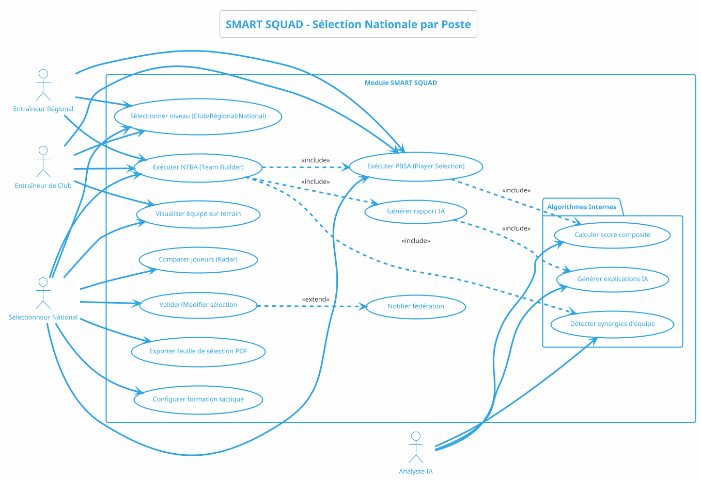

### 1.3 Cas d'Utilisation - Gestion des Licences et Paiement

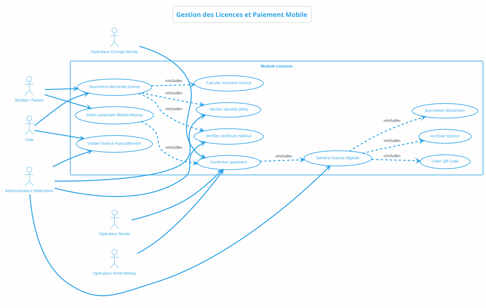

---

## 2. Diagrammes de Classes

### 2.1 Modèle de Données Principal

```plantuml
@startuml
!theme cerulean-outline
skinparam backgroundColor #FEFEFE
skinparam classAttributeIconSize 0

title SPORT CONNECT - Modèle de Classes Principal

' ============ ENUMS ============
enum SportType {
    FOOTBALL
    BASKETBALL
    ATHLETISME
    JUDO
    TENNIS
    NATATION
    VOLLEYBALL
    HANDBALL
    RUGBY
    E_SPORT
}

enum UserRole {
    ATHLETE
    COACH
    FED_ADMIN
    OFFICIAL
    SCOUT
    DOCTOR
    SELECTOR
    FAN
    SYS_ADMIN
}

enum LicenseStatus {
    PENDING
    ACTIVE
    EXPIRED
    SUSPENDED
    REVOKED
}

enum PaymentStatus {
    PENDING
    COMPLETED
    FAILED
    REFUNDED
}

enum SelectionLevel {
    CLUB
    REGIONAL
    NATIONAL
}

' ============ CLASSES UTILISATEURS ============
abstract class User {
    - id: UUID
    - email: String
    - passwordHash: String
    - nin: String
    - phone: String
    - role: UserRole
    - createdAt: DateTime
    - updatedAt: DateTime
    - lastLogin: DateTime
    - isActive: Boolean
    + authenticate(): AuthToken
    + updateProfile(data: UserData): void
    + changePassword(oldPwd: String, newPwd: String): Boolean
    + generate2FACode(): String
}

class Athlete {
    - firstName: String
    - lastName: String
    - birthDate: Date
    - gender: Gender
    - height: Float
    - weight: Float
    - dominantSide: Side
    - biography: Text
    - profilePhoto: URL
    - currentClubId: UUID
    - federationIds: List<UUID>
    + getAge(): Integer
    + calculateBMI(): Float
    + getCurrentForm(): PerformanceMetrics
    + getCareerStats(): CareerStatistics
}

class Coach {
    - firstName: String
    - lastName: String
    - specializations: List<SportType>
    - certifications: List<Certification>
    - currentClubId: UUID
    - experienceYears: Integer
    + evaluateAthlete(athleteId: UUID, evaluation: EvaluationForm): Evaluation
    + createTrainingPlan(athleteIds: List<UUID>): TrainingPlan
}

class Scout {
    - firstName: String
    - lastName: String
    - assignedRegions: List<Region>
    - specializations: List<SportType>
    - employer: String
    + submitEvaluation(evaluation: TalentEvaluation): void
    + searchTalents(criteria: SearchCriteria): List<Athlete>
}

class Doctor {
    - firstName: String
    - lastName: String
    - medicalLicenseNumber: String
    - specializations: List<String>
    - assignedAthletes: List<UUID>
    + createMedicalRecord(athleteId: UUID, record: MedicalRecord): void
    + approveMedicalClearance(athleteId: UUID): MedicalCertificate
    + detectAnomalies(athleteId: UUID): List<Anomaly>
}

class FederationAdmin {
    - federationId: UUID
    - position: String
    - permissions: List<Permission>
    + approveLicense(licenseId: UUID): void
    + createCompetition(data: CompetitionData): Competition
    + generateFederationReport(): Report
}

class Official {
    - firstName: String
    - lastName: String
    - certificationLevel: String
    - sports: List<SportType>
    - badgeNumber: String
    + officiateMatch(matchId: UUID): void
    + enterResults(matchId: UUID, results: MatchResults): void
}

' ============ CLASSES SPORT ============
class Federation {
    - id: UUID
    - name: String
    - sportType: SportType
    - acronym: String
    - logo: URL
    - foundedDate: Date
    - presidentName: String
    - headquarters: Address
    - contactEmail: String
    - contactPhone: String
    - isActive: Boolean
    - website: URL
    + registerAthlete(athlete: Athlete): License
    + createSeason(seasonData: SeasonData): Season
    + getStatistics(): FederationStats
}

class Club {
    - id: UUID
    - name: String
    - foundedDate: Date
    - federationId: UUID
    - address: Address
    - stadium: String
    - colors: List<String>
    - logo: URL
    - category: ClubCategory
    - isProfessional: Boolean
    + addMember(athlete: Athlete): void
    + removeMember(athleteId: UUID): void
    + getRoster(): List<Athlete>
    + getTeamForMatch(formation: Formation): Team
}

class Position {
    - id: UUID
    - sportType: SportType
    - code: String
    - name: String
    - description: Text
    - typicalAttributes: List<String>
    + getEvaluationCriteria(): List<Criteria>
}

' ============ CLASSES LICENCE ============
class License {
    - id: UUID
    - licenseNumber: String
    - athleteId: UUID
    - federationId: UUID
    - clubId: UUID
    - season: String
    - status: LicenseStatus
    - issueDate: Date
    - expiryDate: Date
    - qrCodeData: String
    - paymentReference: String
    - medicalClearanceId: UUID
    - digitalSignature: String
    + verify(): Boolean
    + generateQRCode(): Image
    + toBlockchainEntry(): BlockchainEntry
    + isValid(): Boolean
}

class Payment {
    - id: UUID
    - licenseId: UUID
    - amount: Decimal
    - currency: String
    - paymentMethod: PaymentMethod
    - provider: String
    - providerReference: String
    - status: PaymentStatus
    - initiatedAt: DateTime
    - completedAt: DateTime
    - receiptUrl: URL
    + verifyWithProvider(): Boolean
    + refund(): Boolean
    + generateReceipt(): PDF
}

' ============ CLASSES COMPÉTITION ============
class Competition {
    - id: UUID
    - name: String
    - federationId: UUID
    - season: String
    - category: String
    - startDate: Date
    - endDate: Date
    - format: CompetitionFormat
    - status: CompetitionStatus
    - location: String
    - maxParticipants: Integer
    - registrationDeadline: Date
    + generateSchedule(): List<Match>
    + calculateStandings(): List<Standing>
    + registerParticipant(athleteOrTeam): Registration
}

class Match {
    - id: UUID
    - competitionId: UUID
    - round: Integer
    - matchNumber: String
    - homeParticipant: Participant
    - awayParticipant: Participant
    - scheduledDate: DateTime
    - venue: String
    - status: MatchStatus
    - officialId: UUID
    - results: MatchResults
    - statistics: MatchStatistics
    - incidents: List<Incident>
    - videoUrl: URL
    + startMatch(): void
    + endMatch(): void
    + recordResult(result: MatchResults): void
    + generateMatchSheet(): PDF
}

class Participant {
    - id: UUID
    - type: ParticipantType
    - athleteId: UUID
    - teamId: UUID
    - clubId: UUID
    - seed: Integer
    - isBye: Boolean
}

class Standing {
    - competitionId: UUID
    - participantId: UUID
    - position: Integer
    - played: Integer
    - won: Integer
    - drawn: Integer
    - lost: Integer
    - pointsFor: Integer
    - pointsAgainst: Integer
    - points: Integer
    - form: String
}

' ============ CLASSES PERFORMANCE ============
class Performance {
    - id: UUID
    - athleteId: UUID
    - competitionId: UUID
    - matchId: UUID
    - date: DateTime
    - metrics: PerformanceMetrics
    - notes: Text
    + calculateScore(): Float
    + compareToBaseline(): ComparisonResult
}

class PerformanceMetrics {
    - speed: Float
    - endurance: Float
    - technique: Float
    - mental: Float
    - physical: Float
    - tactical: Float
    + getWeightedScore(weights: Weights): Float
}

class BiometricData {
    - id: UUID
    - athleteId: UUID
    - recordedAt: DateTime
    - deviceId: String
    - vo2Max: Float
    - heartRate: Integer
    - heartRateVariability: Float
    - sleepQuality: Float
    - bodyFat: Float
    - muscleMass: Float
    - gpsTrajectory: GeoJSON
    - altitude: Float
    + detectAnomaly(): AnomalyStatus
}

class MedicalRecord {
    - id: UUID
    - athleteId: UUID
    - doctorId: UUID
    - date: DateTime
    - type: MedicalRecordType
    - diagnosis: Text
    - treatment: Text
    - medications: List<String>
    - restrictions: List<String>
    - clearanceStatus: ClearanceStatus
    - documents: List<URL>
    - isConfidential: Boolean
}

class Injury {
    - id: UUID
    - medicalRecordId: UUID
    - type: String
    - bodyPart: String
    - severity: Severity
    - occurredDate: Date
    - recoveryDays: Integer
    - isRecurring: Boolean
    + getRecoveryStatus(): RecoveryStatus
}

' ============ CLASSES SCOUTING & SMART SQUAD ============
class TalentEvaluation {
    - id: UUID
    - athleteId: UUID
    - scoutId: UUID
    - evaluationDate: DateTime
    - sportType: SportType
    - position: String
    - scores: Map<String, Float>
    - overallScore: Float
    - potential: Potential
    - notes: Text
    - location: String
    - videoUrls: List<URL>
    + calculateCompositeScore(): Float
    + generateAlert(): TalentAlert
}

class SmartSquadSelection {
    - id: UUID
    - selectionType: SelectionLevel
    - sportType: SportType
    - formation: String
    - season: String
    - generatedAt: DateTime
    - generatedBy: UUID
    - status: SelectionStatus
    - selectedPlayers: List<SelectedPlayer>
    - substitutes: List<SelectedPlayer>
    - cohesionScore: Float
    - aiReport: AIReport
    + validateSelection(): void
    + exportToPDF(): Document
    + notifyStakeholders(): void
}

class SelectedPlayer {
    - selectionId: UUID
    - athleteId: UUID
    - position: String
    - isStarter: Boolean
    - selectionScore: Float
    - aiConfidence: Float
    - manualOverride: Boolean
    - overrideReason: String
}

class AIReport {
    - selectionId: UUID
    - generatedAt: DateTime
    - algorithmVersion: String
    - explanations: List<Explanation>
    - synergies: List<SynergyAnalysis>
    - recommendations: List<String>
    + generateNaturalLanguage(): Text
}

class SynergyAnalysis {
    - player1Id: UUID
    - player2Id: UUID
    - synergyScore: Float
    - factors: Map<String, Float>
}

' ============ CLASSES MÉDIA & STREAMING ============
class Stream {
    - id: UUID
    - competitionId: UUID
    - matchId: UUID
    - title: String
    - description: Text
    - startTime: DateTime
    - endTime: DateTime
    - streamUrl: URL
    - streamKey: String
    - status: StreamStatus
    - viewerCount: Integer
    - quality: String
    - isRecording: Boolean
    + start(): void
    + stop(): void
    + getAnalytics(): StreamAnalytics
}

class Subscription {
    - id: UUID
    - userId: UUID
    - type: SubscriptionType
    - startDate: Date
    - endDate: Date
    - amount: Decimal
    - features: List<String>
    - isActive: Boolean
    + renew(): void
    + cancel(): void
    + upgrade(newType: SubscriptionType): void
}

class VideoArchive {
    - id: UUID
    - matchId: UUID
    - title: String
    - duration: Integer
    - thumbnail: URL
    - videoUrl: URL
    - uploadDate: DateTime
    - views: Integer
    - tags: List<String>
    + generateThumbnail(): Image
    + extractHighlights(): List<Clip>
}

' ============ RELATIONS ============
User <|-- Athlete
User <|-- Coach
User <|-- Scout
User <|-- Doctor
User <|-- FederationAdmin
User <|-- Official

Athlete "1" -- "0..*" License : possède >
Athlete "1" -- "0..*" Performance : réalise >
Athlete "1" -- "0..*" BiometricData : génère >
Athlete "1" -- "0..1" MedicalRecord : a >
Athlete "1" -- "0..*" Injury : subit >
Athlete "1" -- "0..*" TalentEvaluation : évalué par >

Federation "1" -- "0..*" Club : contient >
Federation "1" -- "0..*" Competition : organise >
Federation "1" -- "0..*" License : émet >
Federation "1" -- "0..*" Position : définit >

Club "1" -- "0..*" Athlete : emploie >

License "1" -- "1" Payment : associé à >

Competition "1" -- "0..*" Match : contient >
Competition "1" -- "0..*" Standing : produit >

Match "1" -- "2" Participant : oppose >
Match "1" -- "0..1" Stream : diffusé via >
Match "1" -- "0..1" VideoArchive : archivé dans >

Coach "1" -- "0..*" TalentEvaluation : crée >
Scout "1" -- "0..*" TalentEvaluation : crée >

SmartSquadSelection "1" -- "0..*" SelectedPlayer : contient >
SmartSquadSelection "1" -- "0..1" AIReport : génère >
SelectedPlayer "1" -- "1" Athlete : référence >

Doctor "1" -- "0..*" MedicalRecord : crée >
Doctor "1" -- "0..*" BiometricData : consulte >

Athlete "1" -- "0..1" Subscription : souscrit >

@enduml
```

### 2.2 Modèle de Classes - IA et Algorithmes

```plantuml
@startuml
!theme cerulean-outline
skinparam backgroundColor #FEFEFE
skinparam classAttributeIconSize 0

title SPORT CONNECT - Modèle de Classes IA et Algorithmes

' ============ ALGORITHM INTERFACES ============
interface ITalentScoringAlgorithm {
    + calculateScore(metrics: PerformanceMetrics, weights: WeightConfig): ScoreResult
    + classifyTalent(score: Float): TalentCategory
}

interface ITeamBuildingAlgorithm {
    + buildTeam(candidates: List<Athlete>, formation: Formation, constraints: Constraints): TeamResult
    + calculateSynergy(player1: Athlete, player2: Athlete): Float
    + optimizeFormation(team: Team, opponent: Team): FormationAdvice
}

interface IAnomalyDetectionAlgorithm {
    + detectAnomaly(athleteId: UUID, newPerformance: Performance): AnomalyResult
    + calculateZScore(historical: List<Performance>, current: Performance): Float
    + generateAlert(anomaly: AnomalyResult): Alert
}

interface IRecommendationEngine {
    + recommendContent(userId: UUID, contentType: ContentType): List<Content>
    + calculateSimilarity(user1: User, user2: User): Float
    + updateModel(interaction: UserInteraction): void
}

' ============ ALGORITHM IMPLEMENTATIONS ============
class TalentScoringSystem {
    - weights: WeightConfig
    - ageBonusMultiplier: Float
    - injuryPenalty: Float
    + calculateScore(metrics: PerformanceMetrics, athlete: Athlete): ScoreResult
    - applyAgeBonus(score: Float, age: Integer): Float
    - applyInjuryPenalty(score: Float, injuries: List<Injury>): Float
    - categorize(score: Float): String
}

class PositionBasedSelectionAlgorithm {
    - positionWeights: Map<String, WeightConfig>
    - formWindowDays: Integer
    - experienceMultiplier: Float
    + selectBestForPosition(athletes: List<Athlete>, position: Position, season: String): RankedAthletes
    - calculateTechnicalScore(athlete: Athlete, criteria: List<String>): Float
    - calculateFormScore(performances: List<Performance>): Float
    - calculateHealthScore(injuries: List<Injury>): Float
    - calculateExperienceScore(matchCount: Integer): Float
}

class NationalTeamBuilderAlgorithm {
    - synergyThreshold: Float
    - maxAge: Integer
    - minMatches: Integer
    + buildNationalTeam(sport: SportType, formation: String, pool: List<Athlete>): TeamSelection
    - validateConstraints(selection: SelectedPlayer): Boolean
    - calculateTeamSynergy(selectedPlayers: List<SelectedPlayer>): Float
    - generateSelectionReport(selection: TeamSelection): AIReport
}

class PerformanceAnomalyDetector {
    - zScoreCritical: Float
    - zScoreWarning: Float
    - lookbackMonths: Integer
    + detectAnomaly(athleteId: UUID, performance: Performance): AnomalyDetectionResult
    - loadHistoricalData(athleteId: UUID, months: Integer): List<Performance>
    - calculateStatistics(data: List<Performance>): Statistics
    - notifyStakeholders(athleteId: UUID, severity: String): void
}

class CollaborativeFilteringEngine {
    - similarityMatrix: Matrix
    - kNeighbors: Integer
    + recommendForUser(userId: UUID, n: Integer): List<Recommendation>
    + calculateUserSimilarity(user1: UUID, user2: UUID): Float
    - buildSimilarityMatrix(): void
    - predictRating(user: UUID, item: UUID): Float
}

class SwissTournamentPairing {
    - byeHandling: String
    + generatePairings(athletes: List<Athlete>, round: Integer, previousResults: Results): List<Pairing>
    - calculateBuchholz(athlete: Athlete, results: Results): Float
    - findNextAvailable(athletes: List<Athlete>, startIndex: Integer, avoid: Set<Pair>): Athlete
    - isValidPairing(a1: Athlete, a2: Athlete, played: Set<Pair>): Boolean
}

' ============ ML MODELS ============
class MLModel {
    - modelId: UUID
    - name: String
    - version: String
    - architecture: String
    - trainingDate: DateTime
    - accuracy: Float
    - isActive: Boolean
    - hyperparameters: Map<String, Any>
    + predict(input: Features): Prediction
    + retrain(data: TrainingData): void
    + evaluate(testData: TestData): Metrics
    + export(): ModelArtifact
}

class TalentPredictionModel {
    - featureImportance: Map<String, Float>
    - threshold: Float
    + predictTalentPotential(athlete: Athlete, age: Integer): PotentialScore
    + explainPrediction(athleteId: UUID): Explanation
}

class InjuryPredictionModel {
    - riskFactors: List<String>
    - workloadThreshold: Float
    + predictInjuryRisk(athlete: Athlete, workload: WorkloadData): RiskScore
    + recommendPrevention(risk: RiskScore): List<String>
}

class MatchOutcomeModel {
    - features: List<String>
    + predictMatch(teamA: Team, teamB: Team, context: MatchContext): Prediction
    + simulateMatch(teamA: Team, teamB: Team, n: Integer): SimulationResult
}

' ============ CONFIGURATION CLASSES ============
class WeightConfig {
    - speed: Float
    - endurance: Float
    - technique: Float
    - mental: Float
    - physical: Float
    - tactical: Float
    - potential: Float
    + validate(): Boolean
    + normalize(): void
}

class PositionWeightConfig {
    - sportType: SportType
    - positionCode: String
    - criteriaWeights: Map<String, Float>
    + getWeight(criteria: String): Float
    + setWeight(criteria: String, weight: Float): void
}

class AlgorithmConfig {
    - algorithmName: String
    - parameters: Map<String, Any>
    - isDefault: Boolean
    + getParameter(key: String): Any
    + updateParameter(key: String, value: Any): void
}

' ============ RESULT CLASSES ============
class ScoreResult {
    - rawScore: Float
    - finalScore: Float
    - category: String
    - breakdown: Map<String, Float>
    - timestamp: DateTime
}

class TeamSelection {
    - selectedPlayers: List<SelectedPlayer>
    - substitutes: List<SelectedPlayer>
    - cohesionScore: Float
    - formation: String
    - generatedAt: DateTime
    + validate(): ValidationResult
    + export(): SelectionExport
}

class AnomalyDetectionResult {
    - athleteId: UUID
    - zScore: Float
    - severity: String
    - historicalMean: Float
    - historicalStdDev: Float
    - currentValue: Float
    - timestamp: DateTime
    + isCritical(): Boolean
}

class Recommendation {
    - contentId: UUID
    - contentType: ContentType
    - predictedScore: Float
    - reason: String
    - confidence: Float
}

' ============ RELATIONS ============
ITalentScoringAlgorithm <|.. TalentScoringSystem
ITeamBuildingAlgorithm <|.. PositionBasedSelectionAlgorithm
ITeamBuildingAlgorithm <|.. NationalTeamBuilderAlgorithm
IAnomalyDetectionAlgorithm <|.. PerformanceAnomalyDetector
IRecommendationEngine <|.. CollaborativeFilteringEngine

MLModel <|-- TalentPredictionModel
MLModel <|-- InjuryPredictionModel
MLModel <|-- MatchOutcomeModel

TalentScoringSystem --> WeightConfig : utilise
PositionBasedSelectionAlgorithm --> PositionWeightConfig : utilise
PositionBasedSelectionAlgorithm --> Position : pour
NationalTeamBuilderAlgorithm --> PositionBasedSelectionAlgorithm : appelle
NationalTeamBuilderAlgorithm --> AIReport : génère

PerformanceAnomalyDetector --> AnomalyDetectionResult : produit
CollaborativeFilteringEngine --> Recommendation : produit

@enduml
```

---

## 3. Diagrammes de Séquence

### 3.1 Processus d'Inscription et Licence Digitale

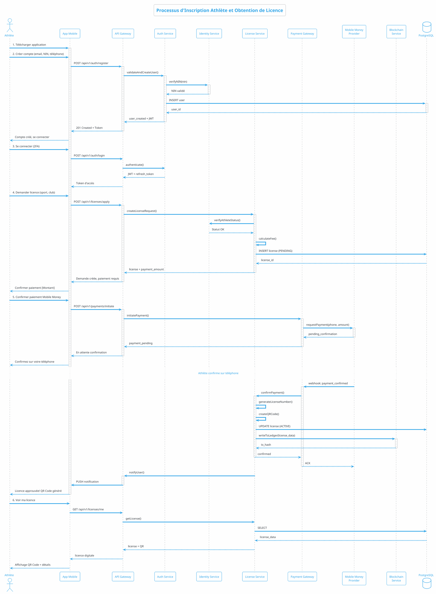

### 3.2 Processus SMART SQUAD - Sélection Nationale

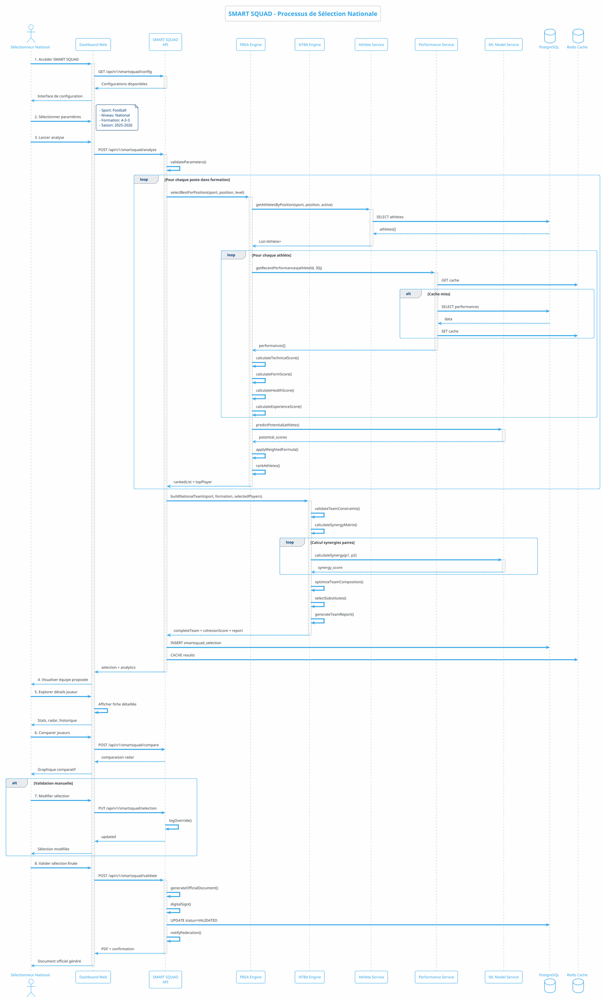

### 3.3 Détection d'Anomalies et Alerte Dopage

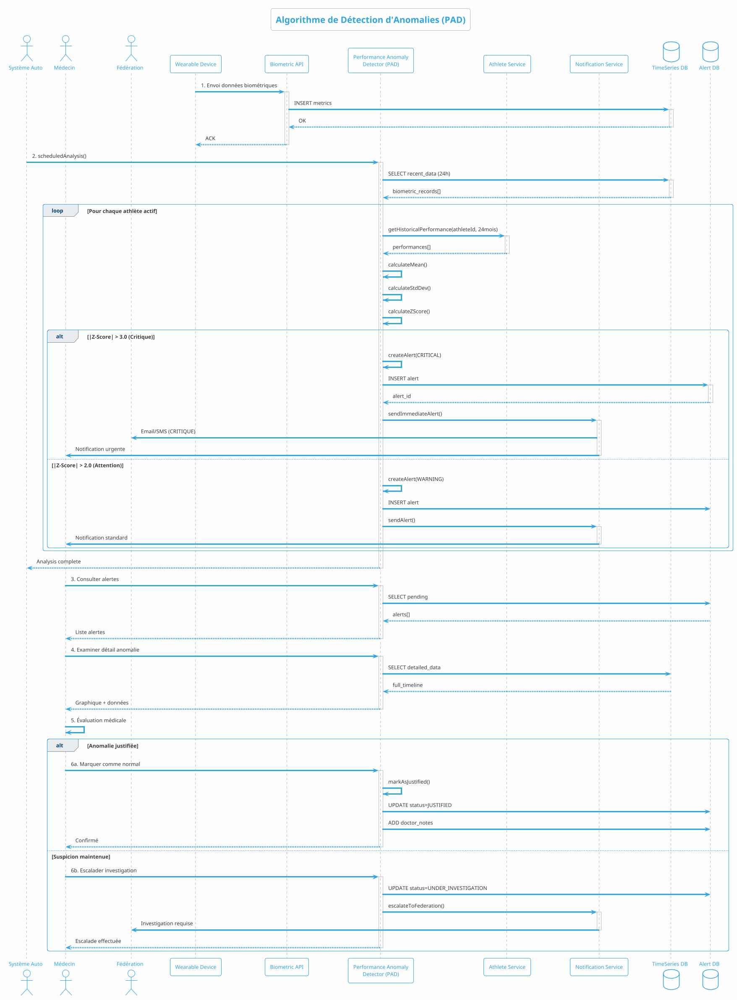

### 3.4 Streaming d'un Match en Direct

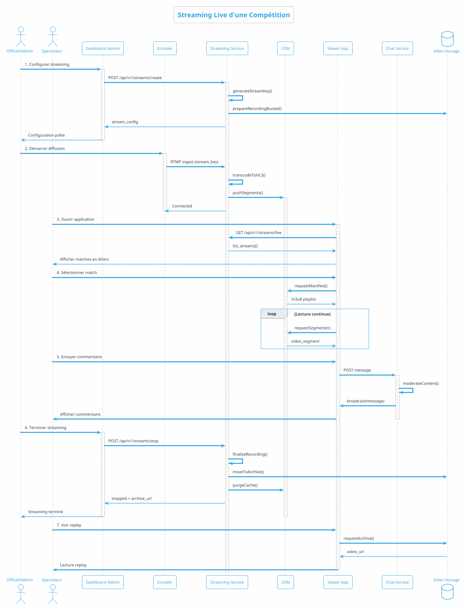

---

## 4. Diagrammes d'Activité

### 4.1 Flux d'Inscription Athlète (Mode Online/Offline)

```plantuml
@startuml
!theme cerulean-outline
skinparam backgroundColor #FEFEFE

title Flux d'Inscription avec Support Offline

start

: Athlète ouvre application;

if (Connexion internet?) then (oui)
  : Mode ONLINE;
  : Saisir informations personnelles;
  : Vérification NIN en temps réel;
  : Upload documents médicaux;
  : Soumettre demande immédiate;
  : Attendre validation fédération;
  if (Validation auto?) then (oui)
    : Génération licence automatique;
  else (non)
    : Revue manuelle fédération;
    : Notification décision;
  endif
else (non)
  : Mode OFFLINE;
  : Saisir informations (stockage local);
  note right
    SQLite local - données chiffrées
  end note
  : Sauvegarde brouillon;
  : Notification: "Synchronisation en attente";
  
  repeat
    : Vérifier connexion;
  backward (toujours offline)
  repeat while (Connexion disponible?) is (non)
  -> oui;
  
  : Synchronisation données;
  : Upload documents en file d'attente;
  : Soumission demande licence;
endif

: Génération QR Code licence;
: Archivage blockchain;
: Notification confirmation;

stop

@enduml
```

### 4.2 Processus de Détection de Talent

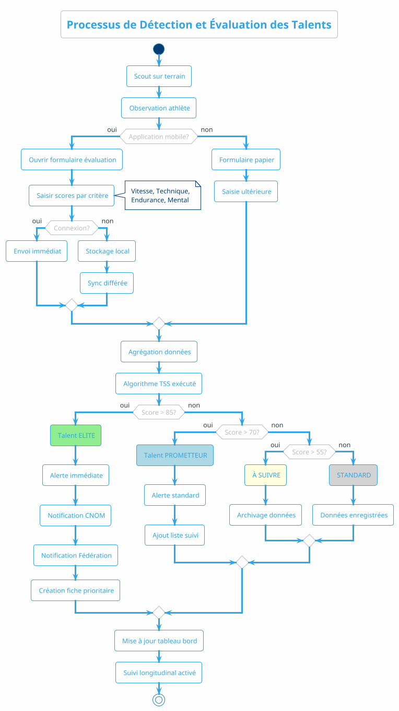

### 4.3 Algorithme de Calcul de Score Composite (PBSA)

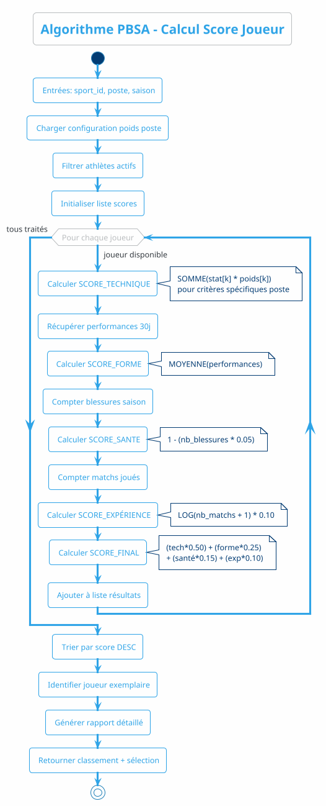

---

## 5. Diagrammes d'État

### 5.1 Cycle de Vie d'une Licence

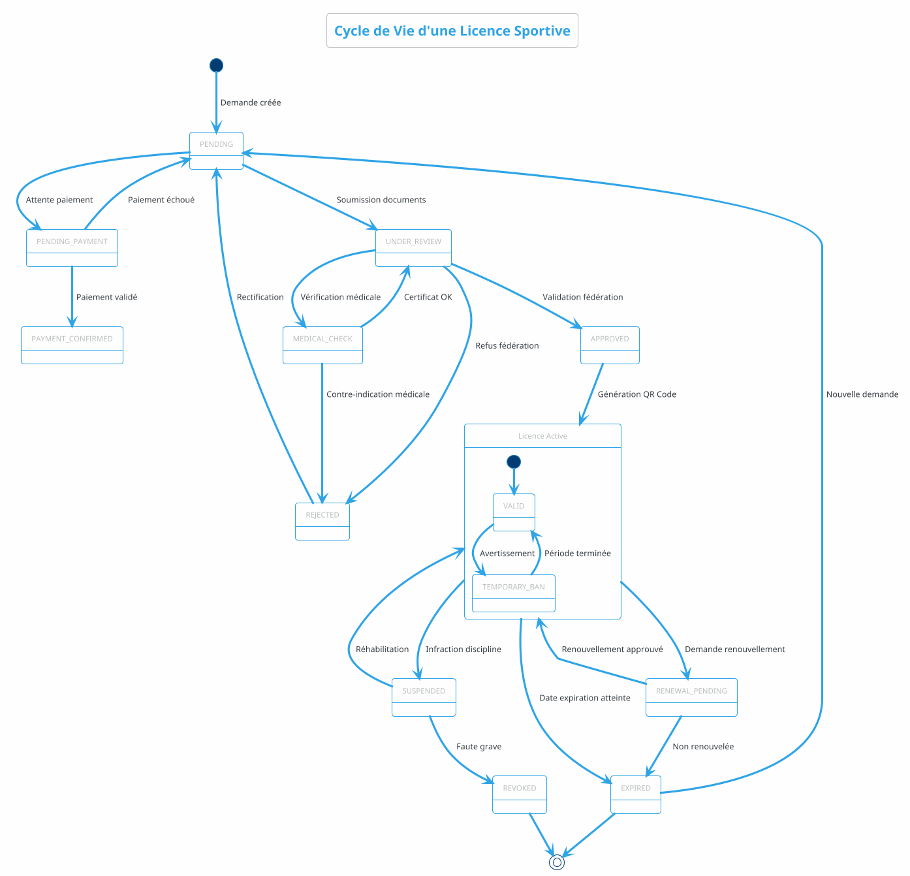

### 5.2 Cycle de Vie d'une Compétition

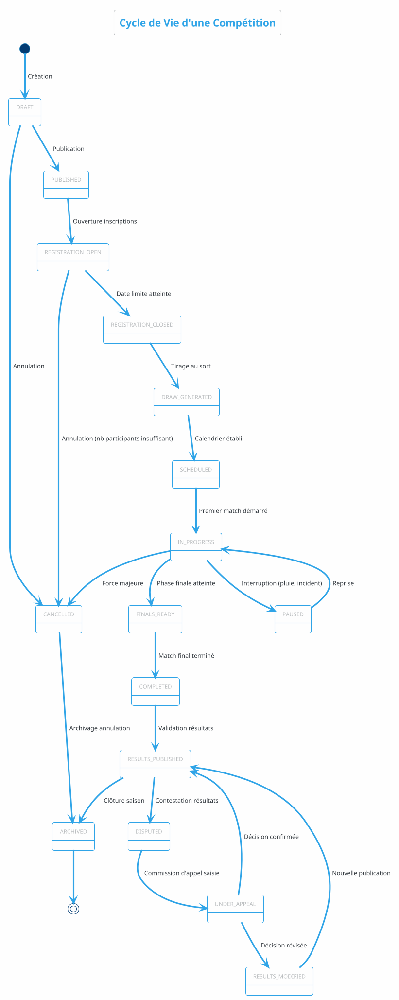

### 5.3 État d'un Streaming Live

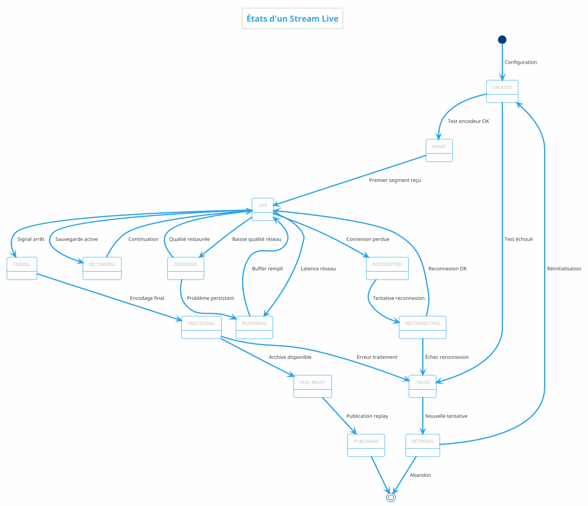

---

## 6. Diagrammes de Composants

### 6.1 Architecture Microservices

```plantuml
@startuml
!theme cerulean-outline
skinparam backgroundColor #FEFEFE

title Architecture Microservices - SPORT CONNECT

left to right direction

package "Couche Présentation" {
    [App Mobile\nReact Native] as MobileApp
    [Dashboard Web\nReact.js] as WebDashboard
    [Streaming Portal\nNext.js] as StreamingUI
}

package "API Gateway Layer" {
    [API Gateway\nKong/AWS API GW] as APIGateway
    [Load Balancer\nNGINX/ALB] as LB
    [CDN\nCloudFront] as CDN
}

package "Services Métier" {
    package "Core Services" {
        [Identity Service\nNode.js] as IdentitySvc
        [Athlete Service\nNode.js] as AthleteSvc
        [License Service\nNode.js] as LicenseSvc
        [Competition Service\nNode.js] as CompSvc
        [Payment Service\nNode.js] as PaySvc
    }
    
    package "Advanced Services" {
        [Scouting Service\nPython/FastAPI] as ScoutSvc
        [SMART SQUAD\nPython/TensorFlow] as SmartSquad
        [Health Service\nNode.js] as HealthSvc
        [Media Service\nNode.js] as MediaSvc
        [Streaming Service\nGo] as StreamSvc
    }
    
    package "AI/ML Services" {
        [ML Inference\nTensorFlow Serving] as MLInference
        [Anomaly Detection\nPython/Scikit] as AnomalySvc
        [Recommendation Engine\nPython/PyTorch] as RecSvc
    }
}

package "Infrastructure Services" {
    [Auth Service\nKeycloak] as AuthSvc
    [Notification Service\nNode.js] as NotifySvc
    [Search Service\nElasticsearch] as SearchSvc
    [Blockchain Service\nHyperledger] as BlockchainSvc
    [File Storage\nAWS S3] as S3
}

package "Couche Données" {
    database "PostgreSQL\n(Données métier)" as Postgres
    database "MongoDB\n(Logs, Analytics)" as Mongo
    database "Redis\n(Cache, Sessions)" as Redis
    database "InfluxDB\n(TimeSeries IoT)" as Influx
    database "S3\n(Vidéos, Archives)" as S3Data
}

package "External Services" {
    [Mobile Money\nMvola API] as Mvola
    [Mobile Money\nAirtel Money API] as Airtel
    [Mobile Money\nOrange Money API] as Orange
    [SMS Gateway\nTwilio] as SMS
    [Email Service\nSendGrid] as Email
    [Maps/GPS\nGoogle Maps] as Maps
}

' Flux client
MobileApp --> APIGateway
WebDashboard --> APIGateway
StreamingUI --> CDN
StreamingUI --> APIGateway

' Gateway
APIGateway --> LB
APIGateway --> AuthSvc
CDN --> StreamSvc

' Core services
LB --> IdentitySvc
LB --> AthleteSvc
LB --> LicenseSvc
LB --> CompSvc
LB --> PaySvc

' Advanced services
LB --> ScoutSvc
LB --> SmartSquad
LB --> HealthSvc
LB --> MediaSvc
LB --> StreamSvc

' AI services
SmartSquad --> MLInference
ScoutSvc --> MLInference
HealthSvc --> AnomalySvc
AthleteSvc --> RecSvc

' Infrastructure
IdentitySvc --> AuthSvc
LicenseSvc --> NotifySvc
CompSvc --> SearchSvc
LicenseSvc --> BlockchainSvc
MediaSvc --> S3
StreamSvc --> S3

' Data layer
IdentitySvc --> Postgres
AthleteSvc --> Postgres
LicenseSvc --> Postgres
CompSvc --> Postgres
PaySvc --> Postgres
HealthSvc --> Postgres
ScoutSvc --> Postgres

HealthSvc --> Influx
StreamSvc --> Influx

All services --> Mongo : logs
All services --> Redis : cache
S3 --> S3Data

' External
PaySvc --> Mvola
PaySvc --> Airtel
PaySvc --> Orange
NotifySvc --> SMS
NotifySvc --> Email
HealthSvc --> Maps

@enduml
```

### 6.2 Composants du Module SMART SQUAD

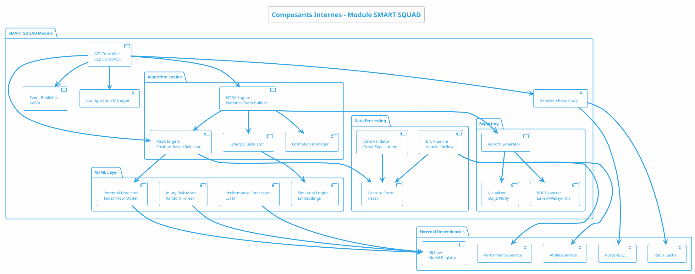

---

## 7. Diagrammes de Déploiement

### 7.1 Architecture Cloud AWS

```plantuml
@startuml
!theme cerulean-outline
skinparam backgroundColor #FEFEFE

title Déploiement AWS - Architecture Cloud SPORT CONNECT

node "Région AWS Afrique (af-south-1)" as Region {
    
    cloud "CloudFront CDN" as CDN {
        [Edge Locations\nAfrique, Europe]
    }
    
    node "VPC SPORT CONNECT" as VPC {
        
        node "Public Subnet (ALB)" as PublicSubnet {
            [Application Load Balancer] as ALB
            [NAT Gateway] as NAT
        }
        
        node "Private Subnet - Application Tier" as AppSubnet {
            package "EKS Cluster / ECS" as K8s {
                [API Gateway Pods] as GatewayPods
                [Identity Service Pods] as IdentityPods
                [Athlete Service Pods] as AthletePods
                [License Service Pods] as LicensePods
                [Competition Service Pods] as CompPods
                [SMART SQUAD Pods] as SmartSquadPods
                [Media Service Pods] as MediaPods
            }
        }
        
        node "Private Subnet - Data Tier" as DataSubnet {
            [RDS PostgreSQL\nMulti-AZ] as RDS
            [ElastiCache Redis\nCluster] as ElastiCache
            [DocumentDB\nMongoDB] as DocDB
            [Timestream\nIoT Data] as Timestream
            [OpenSearch\nElasticsearch] as OpenSearch
        }
        
        node "Private Subnet - AI/ML Tier" as MLSubnet {
            [SageMaker Endpoints] as SageMaker
            [EC2 GPU Instances\nTraining] as GPU
        }
        
        node "Private Subnet - Storage" as StorageSubnet {
            [S3 Bucket\nVidéos/Archives] as S3
            [S3 Glacier\nArchives froides] as Glacier
            [EFS\nFichiers partagés] as EFS
        }
    }
    
    cloud "AWS Services Managés" as Managed {
        [Cognito\nAuth/AuthZ] as Cognito
        [KMS\nChiffrement] as KMS
        [Secrets Manager] as Secrets
        [CloudWatch\nMonitoring] as CloudWatch
        [WAF\nSécurité] as WAF
        [Blockchain\nManaged] as QLDB
    }
}

node "Fédérations / Clubs" as OnPrem {
    [Navigateurs Web] as Browsers
    [Apps Mobiles] as Apps
    [Encodeurs Streaming] as Encoders
}

node "Athlètes / Spectateurs" as Users {
    [Smartphones Android/iOS] as Phones
    [Ordinateurs] as PCs
    [Wearables\nGarmin/Polar] as Wearables
}

node "Partenaires Externes" as Partners {
    [Mobile Money\nMvola/Airtel/Orange] as MobileMoney
    [SMS Providers] as SMS
    [API Fédérations Int'l] as IntFed
}

' Flux réseau
Users --> CDN : HTTPS
Browsers --> CDN
Apps --> CDN
Encoders --> ALB : RTMP/WebRTC

CDN --> ALB : Origin Pull
ALB --> GatewayPods : Route

GatewayPods --> IdentityPods
GatewayPods --> AthletePods
GatewayPods --> LicensePods
GatewayPods --> CompPods
GatewayPods --> SmartSquadPods
GatewayPods --> MediaPods

' Data flow
All services --> RDS
All services --> ElastiCache
All services --> DocDB
HealthSvc --> Timestream
All services --> S3

SmartSquadPods --> SageMaker : Inference
TrainingJobs --> GPU

' Managed services
IdentityPods --> Cognito
All services --> KMS
All services --> Secrets
All services --> CloudWatch : Logs/Metrics
CDN --> WAF
LicensePods --> QLDB

' External
All services --> MobileMoney : API
All services --> SMS
CompSvc --> IntFed
Wearables --> ALB : API Biométrique

@enduml
```

### 7.2 Déploiement Multi-Environnement

```plantuml
@startuml
!theme cerulean-outline
skinparam backgroundColor #FEFEFE

title Pipeline de Déploiement - Environnements SPORT CONNECT

node "Environnement Développement" as Dev {
    [Dev EKS] as DevK8s
    [Dev RDS\n(t2.small)] as DevDB
    [Dev Redis] as DevRedis
    [Dev S3 Bucket] as DevS3
    [LocalStack\nAWS Mock] as LocalStack
}

node "Environnement Staging / QA" as Staging {
    [Staging EKS] as StagK8s
    [Staging RDS\n(db.r5.large)] as StagDB
    [Staging Redis Cluster] as StagRedis
    [Staging S3] as StagS3
    [SonarQube\nCode Quality] as Sonar
    [Selenium Grid\nTests E2E] as Selenium
}

node "Environnement Préproduction" as Preprod {
    [Preprod EKS] as PreK8s
    [Preprod RDS\nMulti-AZ] as PreDB
    [Preprod Redis\nCluster] as PreRedis
    [Preprod S3] as PreS3
}

node "Environnement Production" as Prod {
    package "Région Primaire (af-south-1)" as Primary {
        [Prod EKS\nMulti-AZ] as ProdK8s
        [Prod RDS\nMulti-AZ + Read Replicas] as ProdDB
        [Prod Redis\nCluster Mode] as ProdRedis
        [Prod S3\nVersioning] as ProdS3
    }
    
    package "Région Secondaire (eu-west-1)" as DR {
        [DR EKS] as DRK8s
        [DR RDS\nReplica] as DRDB
        [DR Redis] as DRRedis
        [DR S3\nCross-Region Repl] as DRS3
    }
}

cloud "GitHub / GitLab" as Git {
    [Repository Code] as Repo
    [CI/CD Pipelines] as CI
}

node "Registry" as Registry {
    [ECR\nDocker Images] as ECR
    [Helm Charts] as Helm
}

node "Monitoring" as Mon {
    [Prometheus\nMetrics] as Prom
    [Grafana\nDashboards] as Grafana
    [PagerDuty\nAlerting] as Pager
    [Datadog\nAPM] as Datadog
}

' Pipeline de déploiement
Repo --> CI : Push/MR
CI --> Sonar : Analyse qualité
CI --> ECR : Build & Push images
CI --> Helm : Package charts

ECR --> DevK8s : Déploiement auto
Helm --> DevK8s

DevK8s --> StagK8s : Promotion manuelle
StagK8s --> Selenium : Tests E2E

StagK8s --> PreK8s : Validation QA
PreK8s --> ProdK8s : Approval production

ProdK8s --> DRK8s : Replication async

' Monitoring
All K8s --> Prom : Metrics
Prom --> Grafana
Prom --> Pager : Alertes
All K8s --> Datadog : Traces

@enduml
```

---

## 8. Diagrammes de Packages

### 8.1 Structure du Code Source

```plantuml
@startuml
!theme cerulean-outline
skinparam backgroundColor #FEFEFE

title Structure des Packages - SPORT CONNECT Monorepo

package "sport-connect-monorepo" as Root {
    
    package "apps" as Apps {
        package "mobile-app" as Mobile {
            [src/screens]
            [src/components]
            [src/services/api]
            [src/store/redux]
            [src/utils/offline]
            [android/]
            [ios/]
        }
        
        package "web-dashboard" as Web {
            [src/pages]
            [src/components]
            [src/hooks]
            [src/services]
            [public/]
        }
        
        package "streaming-portal" as Stream {
            [src/player]
            [src/live]
            [src/archive]
        }
    }
    
    package "services" as Services {
        package "identity-service" as Identity {
            [src/controllers]
            [src/services]
            [src/models]
            [src/middleware]
            [tests/]
        }
        
        package "athlete-service" as Athlete {
            [src/]
        }
        
        package "license-service" as License {
            [src/]
        }
        
        package "competition-service" as Comp {
            [src/]
        }
        
        package "payment-service" as Payment {
            [src/]
            [src/providers/mvola]
            [src/providers/airtel]
            [src/providers/orange]
        }
        
        package "smart-squad-service" as SmartSquad {
            [src/algorithms/pbsa]
            [src/algorithms/ntba]
            [src/ml/models]
            [src/ml/training]
            [src/api/]
        }
        
        package "scouting-service" as Scouting {
            [src/]
        }
        
        package "health-service" as Health {
            [src/anomaly-detection]
            [src/biometrics]
            [src/telemedicine]
        }
        
        package "media-service" as Media {
            [src/streaming]
            [src/processing]
        }
        
        package "notification-service" as Notify {
            [src/channels]
        }
    }
    
    package "shared" as Shared {
        package "libs" as Libs {
            [types/\nTypeScript definitions]
            [utils/\nCommon utilities]
            [constants/\nApp constants]
            [api-client/\nGenerated clients]
        }
        
        package "infrastructure" as Infra {
            [terraform/\nAWS Infra]
            [kubernetes/\nK8s manifests]
            [docker/\nDockerfiles]
            [helm/\nCharts]
        }
        
        package "database" as DB {
            [migrations/]
            [seeds/]
            [schemas/]
        }
    }
    
    package "docs" as Docs {
        [api/\nOpenAPI specs]
        [uml/\nDiagrammes]
        [adr/\nArchitecture decisions]
        [requirements/]
    }
    
    package "scripts" as Scripts {
        [deploy/]
        [setup/]
        [ci/]
    }
}

' Dépendances
Mobile --> Libs
Web --> Libs
Stream --> Libs

All services --> Libs
All services --> DB
SmartSquad --> Libs

@enduml
```

---

## 9. Diagrammes Supplémentaires

### 9.1 Diagramme de Réseau et Sécurité

```plantuml
@startuml
!theme cerulean-outline
skinparam backgroundColor #FEFEFE

title Architecture Réseau et Sécurité

node "Internet" as Internet {
}

node "AWS Cloud" as AWS {
    
    node "Edge Security" as Edge {
        [Route 53\nDNS] as DNS
        [AWS WAF\nFirewall] as WAF
        [AWS Shield\nDDoS Protection] as Shield
        [Certificate Manager\nSSL/TLS] as ACM
    }
    
    node "VPC SPORT-CONNECT" as VPC {
        
        node "DMZ / Public" as DMZ {
            [Bastion Host\nJump Server] as Bastion
            [NAT Gateway] as NAT
        }
        
        node "Application Tier" as App {
            [Kubernetes\nWorker Nodes] as K8s
        }
        
        node "Data Tier" as Data {
            [RDS PostgreSQL] as RDS
            [ElastiCache] as Redis
        }
        
        node "Management Tier" as Mgmt {
            [Jenkins/\nGitLab CI] as CI
            [Prometheus/\nGrafana] as Mon
        }
    }
    
    node "Security Services" as Sec {
        [AWS KMS\nKey Management] as KMS
        [Secrets Manager] as Secrets
        [CloudTrail\nAudit Logs] as Trail
        [Config\nCompliance] as Config
        [GuardDuty\nThreat Detection] as Guard
    }
}

node "Partenaires" as Partners {
    [Mobile Money] as MM
    [Fédérations] as Feds
    [CNOM] as CNOM
}

' Flux
Internet --> DNS : HTTPS/443
DNS --> WAF
WAF --> Shield
Shield --> K8s : ALB

K8s --> RDS : Port 5432
K8s --> Redis : Port 6379

Mgmt --> Bastion : SSH/22
Bastion --> K8s : Admin

K8s --> MM : API HTTPS
K8s --> Feds : VPN/HTTPS
K8s --> CNOM : VPN/HTTPS

' Sécurité
All services --> KMS : Chiffrement
All services --> Secrets : Credentials
All services --> Trail : Logs
Guard --> Trail : Alertes

@enduml
```

### 9.2 Diagramme Entité-Relation (Simplifié)

```plantuml
@startuml
!theme cerulean-outline
skinparam backgroundColor #FEFEFE
skinparam linetype ortho

title Modèle Entité-Relation Simplifié

entity "User" as User {
    * id : UUID <<PK>>
    --
    * email : String
    * password_hash : String
    * nin : String <<unique>>
    * phone : String
    * role : Enum
    * is_active : Boolean
    * created_at : Timestamp
}

entity "Athlete" as Athlete {
    * user_id : UUID <<PK, FK>>
    --
    * first_name : String
    * last_name : String
    * birth_date : Date
    * gender : Enum
    height : Float
    weight : Float
    current_club_id : UUID <<FK>>
}

entity "Federation" as Federation {
    * id : UUID <<PK>>
    --
    * name : String
    * sport_type : Enum
    * acronym : String
    * president_name : String
}

entity "Club" as Club {
    * id : UUID <<PK>>
    --
    * name : String
    * federation_id : UUID <<FK>>
    * founded_date : Date
    * is_professional : Boolean
}

entity "License" as License {
    * id : UUID <<PK>>
    --
    * athlete_id : UUID <<FK>>
    * federation_id : UUID <<FK>>
    * club_id : UUID <<FK>>
    * season : String
    * status : Enum
    * qr_code : String
    * issue_date : Date
    * expiry_date : Date
}

entity "Competition" as Competition {
    * id : UUID <<PK>>
    --
    * name : String
    * federation_id : UUID <<FK>>
    * season : String
    * start_date : Date
    * end_date : Date
    * status : Enum
}

entity "Match" as Match {
    * id : UUID <<PK>>
    --
    * competition_id : UUID <<FK>>
    * round : Integer
    * scheduled_date : Timestamp
    * venue : String
    * status : Enum
}

entity "Performance" as Performance {
    * id : UUID <<PK>>
    --
    * athlete_id : UUID <<FK>>
    * match_id : UUID <<FK>>
    * date : Timestamp
    * metrics : JSONB
    * overall_score : Float
}

entity "TalentEvaluation" as Eval {
    * id : UUID <<PK>>
    --
    * athlete_id : UUID <<FK>>
    * scout_id : UUID <<FK>>
    * evaluation_date : Timestamp
    * scores : JSONB
    * overall_score : Float
    * potential : Enum
}

entity "SmartSquadSelection" as Selection {
    * id : UUID <<PK>>
    --
    * selection_type : Enum
    * sport_type : Enum
    * formation : String
    * season : String
    * generated_at : Timestamp
    * status : Enum
}

entity "SelectedPlayer" as SelPlayer {
    * selection_id : UUID <<PK, FK>>
    * athlete_id : UUID <<PK, FK>>
    --
    * position : String
    * is_starter : Boolean
    * selection_score : Float
}

entity "BiometricData" as Bio {
    * id : UUID <<PK>>
    --
    * athlete_id : UUID <<FK>>
    * recorded_at : Timestamp
    * vo2_max : Float
    * heart_rate : Integer
    * gps_data : JSONB
}

' Relations
User ||--|| Athlete
Athlete }|--|| Club : "appartient à"
Club }|--|| Federation : "affilié à"
Athlete }|--o{ License : "détient"
Federation ||--o{ License : "émet"
Federation ||--o{ Competition : "organise"
Competition ||--o{ Match : "contient"
Athlete ||--o{ Performance : "réalise"
Match ||--o{ Performance : "inclut"
Athlete ||--o{ Eval : "évalué dans"
Athlete ||--o{ Bio : "génère"
Selection ||--|{ SelPlayer : "inclut"
SelPlayer }|--|| Athlete : "sélectionne"

@enduml
```

---

## Références

- **Cahier des Charges**: SPORT CONNECT - L'Écosystème Numérique du Sport Malgache (Mars 2025)
- **Méthodologie MoSCoW**: Priorisation des exigences fonctionnelles
- **Estimation COCOMO II**: 153 KLOC, 742 Person-Months, Budget 8.04 Md MGA
- **Architecture**: Microservices Cloud-Native (AWS)
- **Module SMART SQUAD**: Sélection nationale par poste avec IA

---

*Document généré pour le projet SPORT CONNECT - Numérique de Madagascar 2035*
*Auteur: RANDRIANIRINA Harena Eric Miaritsoa - SE20240079*
